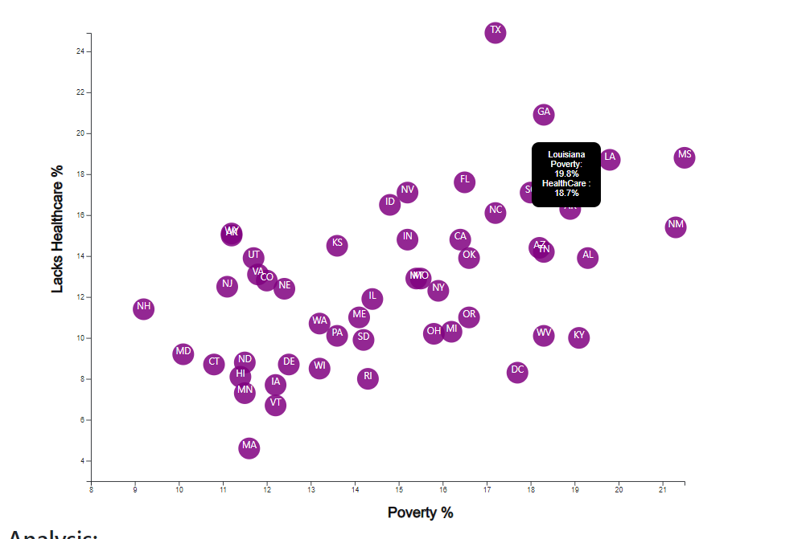

# Data Journalism and D3

In this project, we utilized the D3 JScript library and plotted our specific data file using a scalable vector graphic to display our scatter plot.

Included in this graph are specific tool tips that populate the Poverty % level and Lacks Healthcare % of each specific state in the United States.  

Below is a screenshot:

